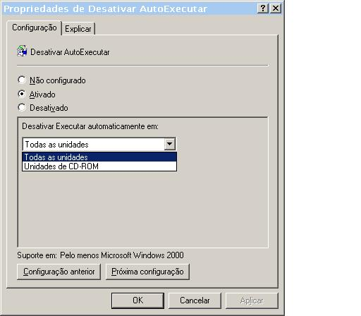

id=121
title=Proteja-se Contra Virus(Disable USB Autorun)
date=2009-07-18 22:43:45
type=post
status=published
tags= Proteção, Virus, Windows
~~~~~~

Meus amigos professores sempre reclamam que não conseguem manter seus PCs/NoteBooks livres de vírus. 
E uma queixa maior é a infestação por uso de dispositivos usb (pen drive). 
http://www.sizlopedia.com/2008/03/18/disable-usb-autorun-to-save-pc-from-usb-viruses/[Encontrei uma dica excelente sobre o assunto].  

Procuro retratar a mesma dica, mas para os brasileiros. A melhor forma de manter longe a auto 
instalação/execução de virus de USB em seu Desktop é desabilitando a característica de 
auto-execução para esses dispositivos. 

Irei demonstrar como fazê-lo:

  1. clique no botão Iniciar, depois escolha Executar... e na caixa de texto digite "gpedit.msc" sem aspas 
  2. escolha Configuração do Computador -> Modelos Administrativos -> Sistema  image:gpedit.msc.jpeg[Diretivas de Grupo]

  3. entre os itens escolha Desativar AutoExecutar e clique duas vezes nele 
  4. clique em "Ativado", então em "Desativar Executar automaticamente em:" selecione "Todas as unidades"  

Esta configuração o protegerá da invasão automática de vírus por esse ou outro dispositivo, assim que você o conectar ao PC. 
A proteção se completa com uma solução contra vírus, ou seja, um antivírus. Recomendo um de uso pessoal - http://free.avg.com/[AVG] - sem custo algum.