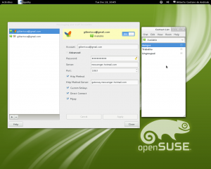

id=415
title=Empathy não conectando ao MSN
date=2010-06-22 10:28:24
type=post
status=published
tags=Empathy,  Gnome, Linux, MSN
~~~~~~

Recentimente resolvi, novamente, atualizar o gnome da versão 2.28 para 2.30 
através do procedimento descrito neste endereço: http://en.openSUSE.org/GNOME/2.30[].  
Como sempre sem problemas. http://www.gnome.org/[O gnome] é um ambiente 
bastante consistente e a meu ver seguro! Mas um componente que uso como meio de 
comunicação - http://live.gnome.org/Empathy[Empathy] - começou a apresentar 
um erro conexão usando o protocolo MSN. Não havia percebido tal problema porque até então 
só tinha utilizado o http://pt.wikipedia.org/wiki/Extensible_Messaging_and_Presence_Protocol[protocolo Jabber].

Bem, após uma pesquisa pelo google, http://ubuntu-utah.ubuntuforums.org/showpost.php?p=8058121&postcount=9[encontrei a solução do problema]: 
desisntalar o pacote *telepathy-butterfly*. Lembrando que há a necessidade de fechar o programa antes de remover este componente.

*Atualização(13/12/2011):* 
Hoje, após uma atualização, o empathy parou de conectar. 
Voltando http://forums.openSUSE.org/english/get-technical-help-here/applications/467973-empathy-not-working-msn-2.html#post2417727[àquela discussão no forum openSUSE],
notei que a solução é bem mais simples:


. Remova sua conta(Remove your live account).
. Sair do Empathy(Exit from Empathy)
. Desinstalar o pacote (Remove telepathy-butterfly)
. Encerrar sua sessão/Entrar em uma nova sessão(logout/login)
. Adicione sua conta MSN novamente(Enter your account again)
. Marque a opção Método Http(mark the Http Method option)
 


*Lembre-se*: você precisa fechar o aplicativo(Empathy). 

*Atualização(28/11/2011):* 
No trabalho já estou utilizando o openSUSE 12.1 (adaptando-me ao novo jeito do gnome 3). 
Este gerenciador de mensagens, novamente, veio com problema para conectar ao protocolo MSN. Desta vez não precisamos desinstalar nada, 
apenas realizar uma pequena modificação em uma biblioteca que o acompanha. 
http://forums.openSUSE.org/english/get-technical-help-here/applications/467973-empathy-not-working-msn.html#post2405889[Empathy not working with MSN]

Edite o seguinte arquivo da biblioteca ql:

``` 
gilberto@SUGEP265338:~> sudo vi /usr/lib/python2.7/site-packages/papyon/service/description/AB/__init__.py
```
 
e faça a seguinte modificação:

``` 
#url = "http://contacts.msn.com/abservice/abservice.asmx"
url = "http://local-bay.contacts.msn.com/abservice/abservice.asmx"
```
 
*Lembre-se*: você precisa fechar o aplicativo(Empathy). 

Espero que esta informação ajude a outros colegas usuários linux.