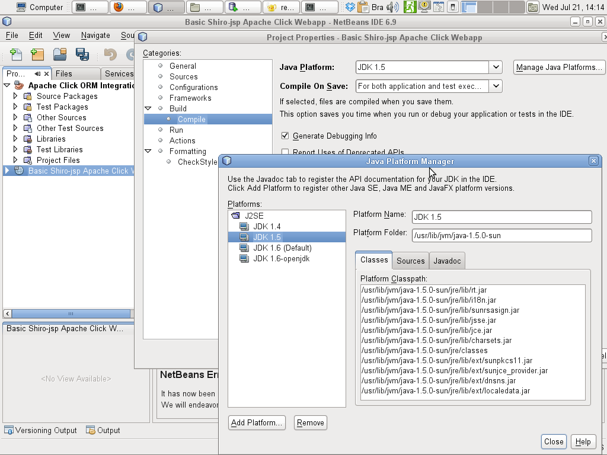

id=432
title=Alterne entre versões Java facilmente [Netbeans 6.*] 
date=2010-07-21 14:22:40
type=post
status=published
tags=Java, Linux, Apache-Maven, openSUSE
~~~~~~

Outro dia escrevi como http://blog.gilbertoca.com/2010/06/alterne-entre-versoes-java-facilmente-update-alternatives.html[alterner entre versões Java facilmente]
 utilizando o utilitário de sistema operacional http://man.he.net/man8/update-alternatives[update-alternatives]. Aquele post tem uma 
perspectiva do lado do servidor onde estão instalados servidores de aplicação java 
ou mesmo aplicativos e o administrador/desenvolvedor precisa testar como estes 
artefatos mencionados se comportariam em cada versão. 

Hoje vou relatar outra maneira de alternar entre versões java em perspectiva do lado do desenvolvedor. 
Aqui na secretaria, podemos escolher entre https://netbeans.apache.org[Netbeans] e http://www.eclipse.org[Eclipse] como ambientes de desenvolvimento, 
desde que o projeto seja gerenciado pela ferramenta de construção http://maven.apache.org[Maven]. 

Minha escolha, assim como de mais alguns colegas foi o http://netbeans.org/index.html[Netbeans] 6.8. 
Vejamos então como configurar o IDE Netbeans para facilitar a traca de versões java para compilar ou rodar aplicativos.  
Tanto para configurar ou mesmo alternar a versão do java utilizado pode-se utilizar o seguinte caminho:  
`Project’s properties->Build:compile`.  

A partir deste diálogo, você poderá alternar de versão através "Java Plataform" ou gerenciar/adicionar/remover versões através da opção “Manage Java Plataforms”  

  

Lembrando que antes disso precisamos instalar as versões que desejamos utilizar.
