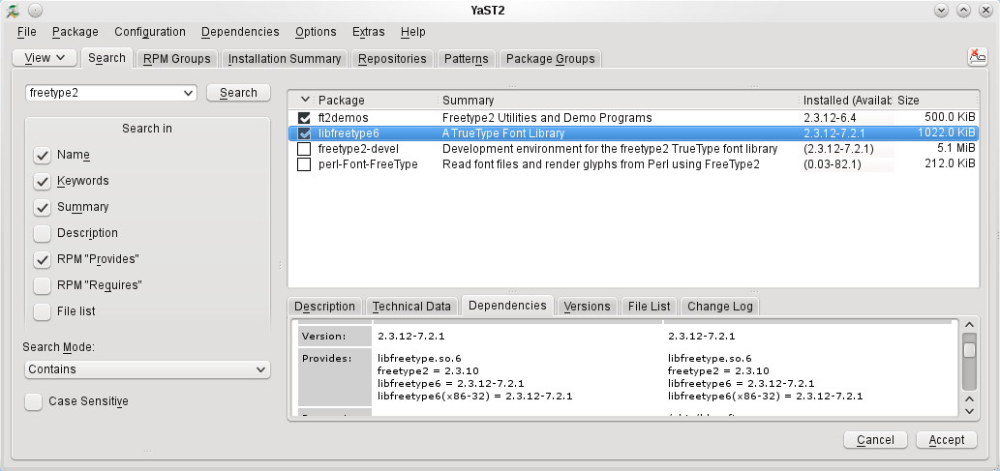
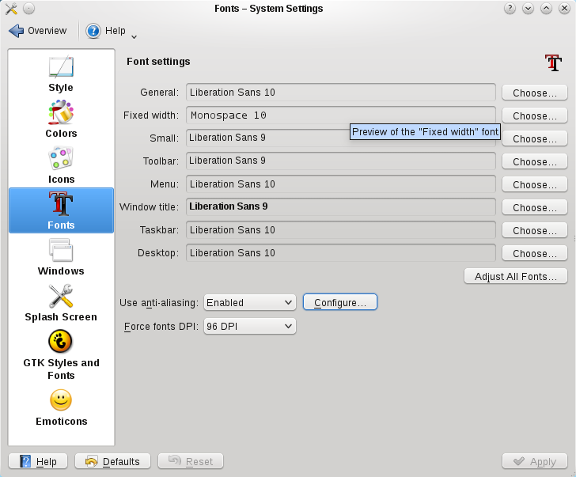
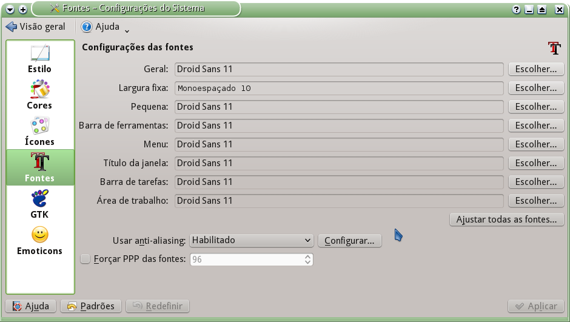

id=452
title=Melhor aparência (fonte)[openSUSE 11.3] 
date=2010-10-22 16:12:35
type=post
status=published
tags=Desktop,  Linux, openSUSE
~~~~~~

Sexta-feira, final de tarde! Um bom motivo para me aventurar em uma área que costumo deixar de lado: configuração do desktop. Primeiro as fontes! 
Percebo que as fontes não são exibidas de forma suave e elas estão bem pequenas devido a minha resolução de vídeo - 1152x864. 
Vou seguir http://www.linuxcrunch.com/content/font-smoothing-openSUSE-112[a seguinte dica], descrita por Fahad:

  1. precisamos instalar o http://software.openSUSE.org/search?q=freetype2&baseproject=openSUSE%3A11.3&lang=en&exclude_filter=home%3A&exclude_debug=true[pacote freetype2] 
    Veja se já instalou:
    

  2. faça o seguinte ajuste em 
    Configure Desktop > Appearance > Fonts
    * "Use anti-aliasing for fonts" > enabled
    * "Force fonts DPI" > 96
    
  3. faça o seguinte ajuste em (através do botão " Configure")    
    "Configure Anti-aliasing Settings" >
    * "Use sub-pixel rendering:" > RGB
    * "Hinting style:" > full

Depois de sair (log ou) e entrar (log in) novamente, você vai notar que o KDE irá exibir as fontes mais suaves.
Depois escolhi outras fontes e aumentei o  tamanho. Ficou um beleza!

Mais uma opção

