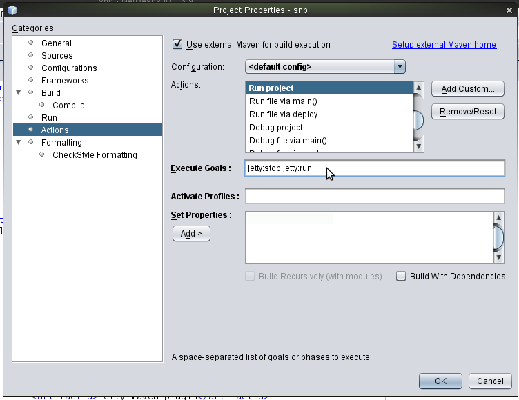

id=679
title=Debugando com Maven Jetty Plugin no Netbeans
date=2011-05-13 16:30:29
type=post
status=published
tags=Apache-Click, Apache-Wicket, Apache-Maven, NetBeans
~~~~~~

http://www.eclipse.org/jetty/[Jetty] é um servidor web excelente. É rápido para iniciar o que o torna muito útil durante o desenvolvimento. 
A http://maven.apache.org/what-is-maven.html[ferramente de construção Maven] possui um http://wiki.eclipse.org/Jetty/Feature/Jetty_Maven_Plugin[plugin Jetty]
que podemos usar em nossos projetos de aplicação Web que utilizam Maven. Desta forma, podemos usar o Jetty para testar nossos 
arquivos HTML/JSP/JSF/Wicket/Click/etc. Podemos editar o arquivo JSP/HTML e atualizar nosso navegador para ver o resultado imediatamente. 
Podemos até mesmo compilar um arquivo de classe Java e o servidor Jetty irá reiniciar para que possamos testar o resultado no nosso navegador. 
Vejamos como configurar o http://www.eclipse.org/jetty/[Jetty], utilizando como IDE o https://netbeans.apache.org[Netbeans 6.9] (deve funcionar para outras versões também!), 
para executar e principalmente para depurar (Debugging) a aplicação:  

**Requisito: ser uma aplicação web gerenciada pelo Maven.** 

. Primeiro vamos habilitar a função Compilar ao Salvar (http://wiki.netbeans.org/FaqCompileOnSave#Using_Compile_on_Save_in_Maven_Projects[Compile On Save]) em nosso projeto. 
Esta função vem habilitada somente para execução de testes em projetos gerenciados pelo Apache-Maven, aqui estamos ajustando para execução do fonte também:  
image:CompileOnSave.png[CompileOnSave,width=804,height=563] 

. Adicione o http://wiki.eclipse.org/Jetty/Feature/Jetty_Maven_Plugin[plugin jetty] para o maven;
+
```Xml
<plugin>
  <groupId>org.mortbay.jetty</groupId>
  <artifactId>jetty-maven-plugin</artifactId>
  <version>7.0.1.v20091125</version>
  <configuration>  
      <!--reload>manual</reload-->
      <scanIntervalSeconds>10</scanIntervalSeconds>
      <stopKey>foo</stopKey>
      <stopPort>9966</stopPort>
  </configuration>
</plugin>
```

. Abra a janela de propriedades do projeto Maven e selecione Ações(Actions) da lista de categorias (Categories). 
Encontre a ação Executar (Run) e altere o valor do campo Metas de Execução (Execute Goals) para *jetty:stop jetty:run* :  
+


. Então, faça o mesmo para ação Depurar Projeto(Debug project) e adicione as seguintes propriedades:  
+
```Shell
jpda.listen=maven netbeans.deploy.debugmode=true
```
image:ActionDebugExecuteGoals.png["ActionDebugExecuteGoals", width=760, height=589] 

O legal é poder depurar a aplicação web.  
Pronto!! image:../../icon_smile.gif[] 

Referências:

  * https://cwiki.apache.org/WICKET/maven-jetty-plugin.html[Using the Maven Jetty plugin - Wicket]
  * http://mrhaki.blogspot.com/2009/02/use-jetty-to-run-maven-web-applications.html[Use Jetty to run Maven web applications in NetBeans]