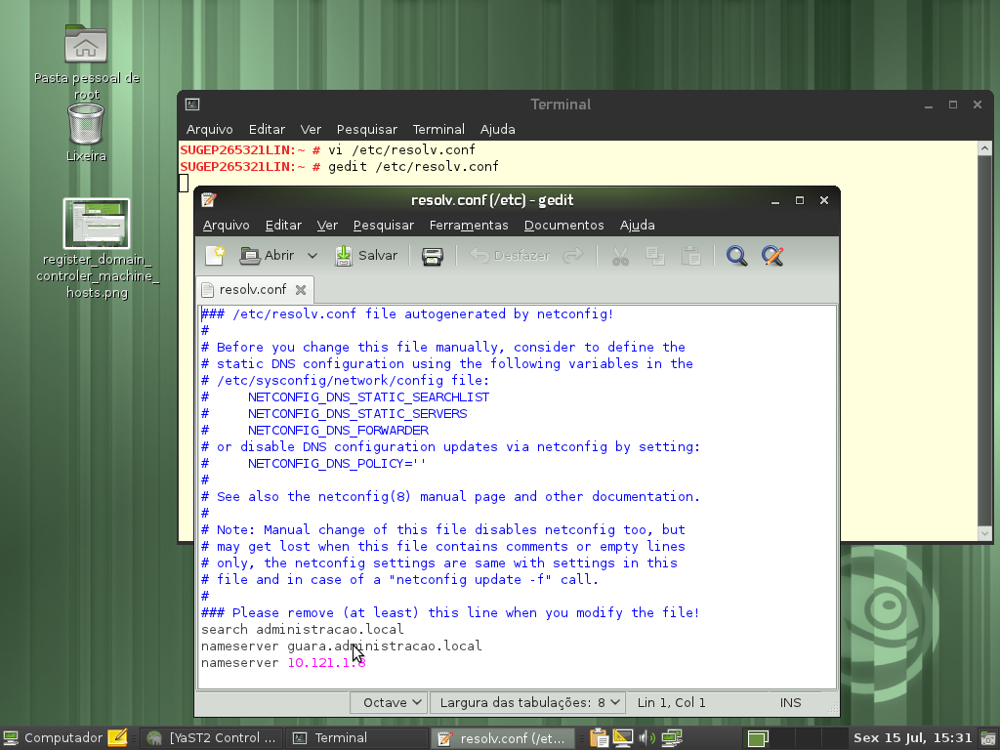
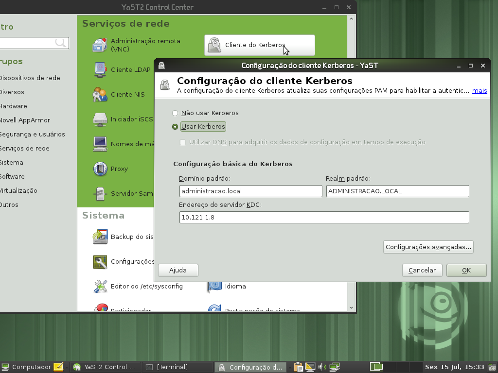
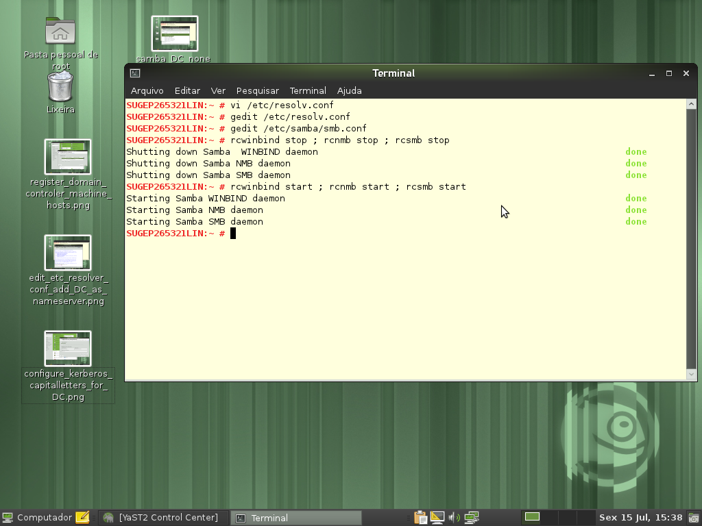

id=764
title=Linux - Participação no domínio do Windows 
date=2011-07-15 22:27:44
type=post
status=published
tags=Active Directory, kerberos, Linux, openSUSE, Windows
~~~~~~

[quote,Viva o Linux]
Eu não quero compartilhar aquivo nenhum, apenas quero me logar no dominio MS, para assim usar internet, e-mail, enfim tudo que uma estação de trabalho com XP faria quando ingressa no dominio!
Eu não quero criar um server com samba sem ser PDC E deixar na rede, quero apenas ao inves de usar o XP como estação de trabalho usar o openSUSE!

Este pedido de ajuda está registrado https://www.vivaolinux.com.br/topico/Suse/Linux-em-dominio-Windows[aqui] na comunidade https://www.vivaolinux.com.br/[Viva o Linux]. 

Apesar de ser uma discussão antiga, ainda assim é bom fazer um passo a passo deste procedimento. Antes devo relatar que aqui na secretaria usamos https://technet.microsoft.com/pt-br/library/cc668412.aspx[Active Directory] 
para autenticação, então foi esse ambiente que usei para testar a inclusão de uma estação https://pt.openSUSE.org/Portal:Distribui%C3%A7%C3%A3o[Linux openSUSE] em um Domínio Windows: 

. Registrar seu controlador de domínio(DC) na lista de nomes de máquinas. Adicione todo o nome qualificado primeiro e o apelido como alias: 192.168.1.2 = server.domain.com server  
  image:1-register_domain_controler_machine_hosts.png["1-register_domain_controler_machine_hosts", width=1024, height=768] 

. Editar o arquivo /etc/resolv.conf e adicionar seu DC como nameserver: nameserver = server.domain.com  
   

. Configure o kerberos através do yast: o realm deverá ser escrito em letra maiúscula: DOMAIN.COM  
   

. Configura o samba  
image:4-samba_DC_none_workgroupname_domain_security_ads_realms.png["4-samba_DC_none_workgroupname_domain_security_ads_realms", width=1024, height=768]
----
  SUGEP265338:~ # more /etc/samba/smb.conf 
  # smb.conf is the main Samba configuration file. You find a full commented
  # version at /usr/share/doc/packages/samba/examples/smb.conf.SUSE if the
  # samba-doc package is installed.
  # Date: 2011-11-02
  [global]
          add machine script = /usr/sbin/useradd -c Machine -d /var/lib/nobody -s /bin/false %m$
          domain master = No
          security = ADS
          workgroup = ADMINISTRACAO
          realm = ADMINISTRACAO.LOCAL
          idmap gid = 10000-20000
          idmap uid = 10000-20000
          usershare allow guests = No
          template homedir = /home/%D/%U
          winbind refresh tickets = yes
          template shell = /bin/bash
  [homes]
          comment = Home Directories
          valid users = %S, %D%w%S
          browseable = No
          read only = No
          inherit acls = Yes
[profiles]
----

Não esqueça de reiniciar os serviços  

Adicionar a máquina ao domínio (neste momento utilizando o kerberos)  
image:6-test_kerberos_autentication.png["6-test_kerberos_autentication", width=1024, height=768] 
net ads join -U Administrador  
image:7-join_ads_domain.png["7-join_ads_domain", width=1024, height=768]   
Adicionar a máquina ao domínio (agora utilizando o samba): no yast use a opção:”Participação no domínio do windows”, 
marcando a opção “Usar informação SMB para autenticação Linux”  
image:8-windows_domain_membership.png["8-windows_domain_membership", width=1024, height=768] 
Reinicie a máquina  
image:9-reboot_linux_client.png["9-reboot_linux_client", width=1024, height=768]
      
Use com moderação! 