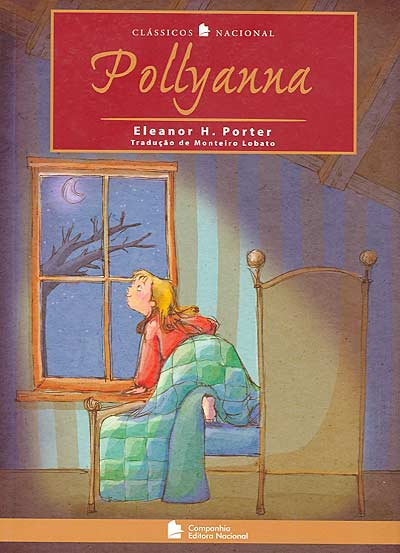

id=1026
title=Clássicos Nacionais - Pollyanna 
date=2013-10-25 15:08:35
type=post
status=published
tags=Estou lendo e você, Geral
~~~~~~

[quote, "Eleanor H. Porter", Pollyanna - Clássicos Nacionais]
____
Aos 11 anos, Pollyanna fica órfã e vai morar com a tia. Passa por muitos momentos difíceis, mas sempre encontra um motivo para ficar feliz. 
Curiosa e atrevida, essa menina transforma os lugares por onde passa e as pessoas que conhece, com seu incrível “Jogo do Contente”, 
descobrindo sempre alguma coisa para se alegrar e levando bom humor onde só havia amarguras, desencadeando em todo o mundo uma impressionante onda de esperança, 
de boa vontade e de entusiasmo, tornando-se símbolo da bondade e do otimismo.
____
